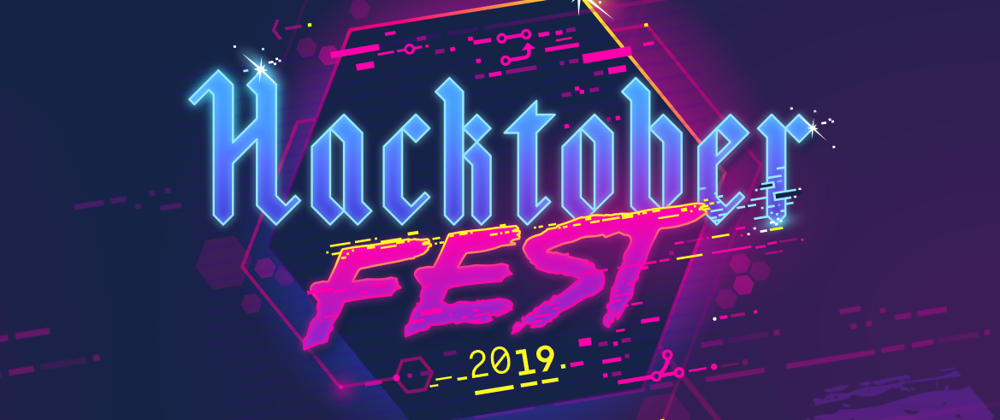

## Welcome to Multilinks [Hacktoberfest](https://hacktoberfest.digitalocean.com) corner

Multilinks is a new kid on the OSS block, checkout the [About Multilinks](https://github.com/ChrisDinhNZ/MultilinksCore/blob/master/ABOUT_MULTILINKS.md) to learn more. We are taking part in Hacktoberfest for the first time and we're really excited.

It's going to be 4.5 weeks packed with coding, designing, documenting, testing, collaborating, but most importantly, learning and fun :relaxed: